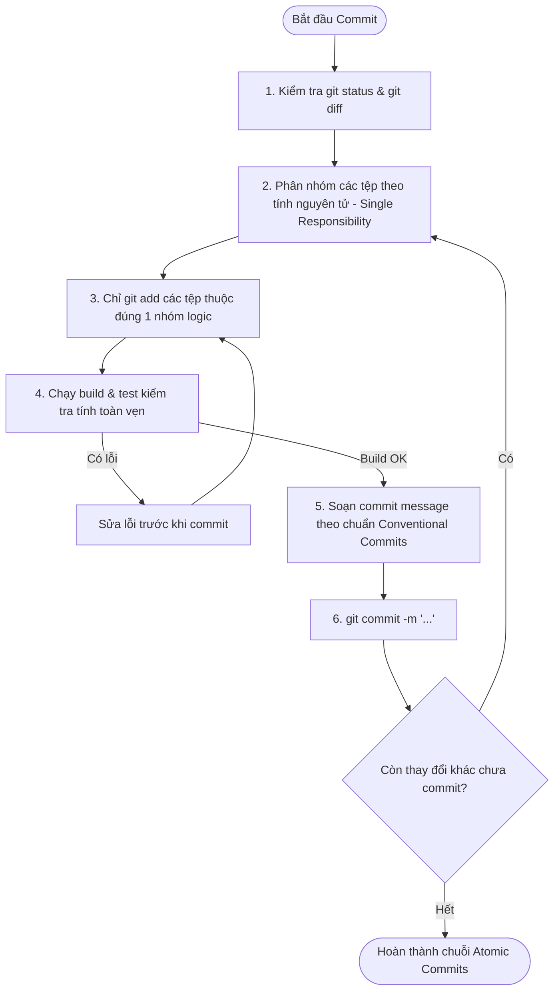

# Atomic Commit & Conventional Commits Skill

This skill enforces the **Atomic Commit Principle** and **Conventional Commits 1.0.0** standard across the WeShare codebase. Every commit must be a single, indivisible, well-tested logical unit of work.

---

## 1. The Atomic Commit Principle

A commit is **atomic** if and only if:
1. **Single Responsibility**: It accomplishes one single logical change (e.g., adding a specific entity, fixing a specific bug, or updating a specific configuration). Never mix refactoring with feature development or bug fixes in the same commit.
2. **Build Integrity**: Every individual commit must leave the codebase in a **compilable, runnable, and test-passing state**. If another developer checks out any commit in the git history, the project must build without errors.
3. **Reversibility**: If a commit introduces a regression, it must be cleanly revertible (`git revert <commit-hash>`) without unintentionally breaking or removing unrelated features.

---

## 2. Conventional Commits Specification

### Commit Message Format
```
<type>(<scope>): <imperative subject line>

[optional body explaining WHY this change was made and key trade-offs]

[optional footer(s): Closes #123, BREAKING CHANGE: ...]
```

### Allowed Types
| Type | Purpose | Example |
|---|---|---|
| **`feat`** | A new feature or capability for the user | `feat(auth): implement email OTP verification with Resend` |
| **`fix`** | A bug fix | `fix(chat): prevent duplicate socket connection on reconnect` |
| **`docs`** | Documentation changes only | `docs(spec): add Saved Posts and Pin Post specifications` |
| **`refactor`**| Code change that neither fixes a bug nor adds a feature | `refactor(posts): extract media validation into custom pipe` |
| **`perf`** | Performance improvement | `perf(feed): add partial index for deleted_at IS NULL on posts` |
| **`test`** | Adding or correcting tests | `test(auth): add unit tests for OTP verification service` |
| **`build`** | Build system, toolchain, or external dependencies | `build(deps): install TypeORM and PostgreSQL driver` |
| **`ci`** | CI/CD pipeline configuration | `ci(github): add workflow for automated testing and linting` |
| **`chore`** | Routine tasks, housekeeping, repo configuration | `chore(docker): configure docker-compose for local development` |

### Scopes in WeShare
- `(auth)`: Authentication, sessions, OTP, OAuth
- `(users)`: User profile, settings
- `(rel)`: Relationships, friendships, follow, block
- `(posts)`: Posts creation, privacy, media tags
- `(interactions)`: Comments, reactions, share, bookmark, pin
- `(feed)`: Newsfeed timeline, cold-start fallback
- `(chat)`: Socket.io, direct & group messages
- `(groups)`: Communities, RBAC, moderation
- `(admin)`: Platform admin, reports queue, audit logs
- `(search)`: Meilisearch integration & sync
- `(db)`: Migrations, schema, entities
- `(ui)`: Reusable frontend components & layouts

---

## 3. Step-by-Step Atomic Commit Workflow

When preparing to commit changes:



### Step 1: Inspect Changes
```bash
git status
git diff --stat
```

### Step 2: Selective Staging (Never blind `git add .` across domains)
Stage only the files that belong together:
```bash
# Ví dụ: Chỉ stage các file liên quan đến entity SavedPost
git add backend/src/modules/posts/entities/saved-post.entity.ts \
        backend/src/database/migrations/*-create-saved-posts.ts
```

### Step 3: Verify Integrity Before Committing
Always ensure the staged changes compile:
```bash
# Kiểm tra build backend nếu commit code backend
cd backend && npm run build

# Hoặc kiểm tra build frontend nếu commit code frontend
cd frontend && npm run build
```

### Step 4: Commit with Imperative Sentence
Use lowercase, no period at the end of the subject, maximum 72 characters:
```bash
git commit -m "feat(posts): add saved posts entity and migration"
```

---

## 4. Anti-Patterns to Avoid

- ❌ **The "Mega Commit"**: Committing backend, frontend, database migrations, and docs all in one single commit with message `update code` or `done sprint 1`.
- ❌ **Broken Builds**: Committing an entity that references a missing service or broken import, planning to "fix it in the next commit".
- ❌ **Vague Messages**: Messages like `fix bug`, `update`, `refactor`, `wip`.
- ❌ **Accidental Files**: Committing `.env`, `.DS_Store`, `node_modules`, or build artifacts. Always check `.gitignore`.
