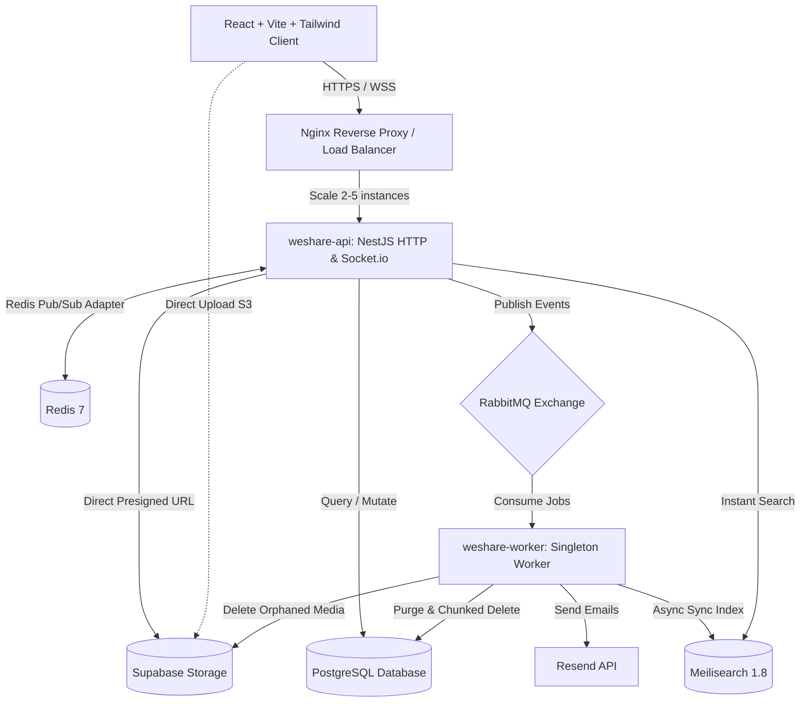

# WeShare — System Architecture

Tài liệu đặc tả kiến trúc chi tiết của hệ thống WeShare được lưu trữ chính thức tại:  
👉 **[docs/02-architecture-spec.md](docs/02-architecture-spec.md)**

---

## Tóm tắt Mô hình Kiến trúc Cốt lõi

### Các Trụ cột Kiến trúc Đã chốt (Sau phiên /grill-me):
1. **Mô hình**: Modular Monolith kết hợp Phân tách Tiến trình (**Process Segregation**: `weshare-api` vs `weshare-worker`).
2. **Database & ORM**: PostgreSQL 16 + TypeORM (Data Mapper, Migrations, Partial Indexes `WHERE deleted_at IS NULL`).
3. **Bảo mật & Phiên Đa Thiết bị**: Bảng `user_sessions` lưu vết thiết bị, IP, User-Agent, hỗ trợ "Đăng xuất khỏi thiết bị khác".
4. **Chiến lược Xóa**: Kết hợp Soft Delete (Thùng rác 30 ngày) và Chunked Hard Delete định kỳ lúc 02:00 AM.
5. **Hàng đợi & Worker**: RabbitMQ Topic Exchange với Dead Letter Exchange (DLX), quản lý cả luồng đồng bộ Meilisearch.
6. **Công cụ Tìm kiếm**: **Meilisearch 1.8** hỗ trợ tìm kiếm siêu tốc, typo-tolerance và auto-complete.
7. **Cold-start Feed**: Fallback Trending Feed tự động kích hoạt khi người dùng mới chưa có bạn bè.
8. **Real-time & Caching**: Redis Pub/Sub Adapter cho Socket.io, Cache feed timeline, quản lý Presence.
9. **Lưu trữ Media**: Supabase Storage với Direct Client Upload qua Presigned URLs.
10. **Quản trị Toàn sàn**: Phân hệ Platform Admin (`@Roles('ADMIN')`) bảo vệ bằng Admin Audit Logs và Hàng đợi Báo cáo.
