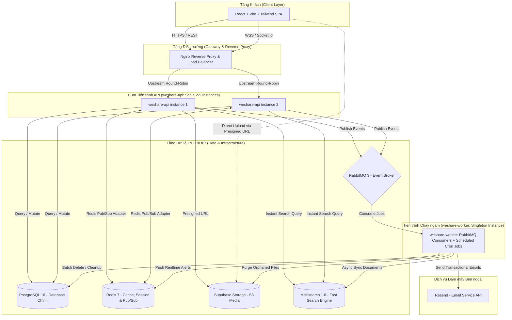
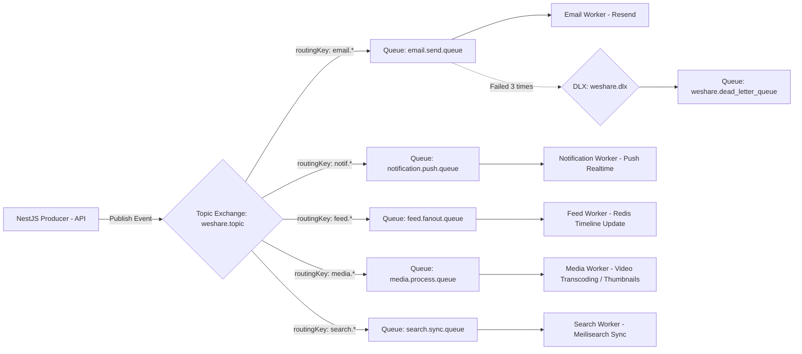

# 02. Đặc tả Kiến trúc Hệ thống (System Architecture Specification)

---

## 1. Tổng quan Kiến trúc: Modular Monolith & Phân tách Tiến trình (Process Segregation)

Hệ thống WeShare được thiết kế theo mô hình **Modular Monolith** kết hợp nguyên lý **Domain-Driven Design (DDD)** và kiến trúc **Phân tách Tiến trình (Process Segregation)** chuẩn Production.

### 1.1. Tại sao lựa chọn Modular Monolith + Process Segregation?
1. **Tránh độ phức tạp phân tán (Distributed Complexity)**: Toàn bộ hệ thống dùng chung một codebase duy nhất, chung cấu hình TypeORM entities và migrations, không gặp bài toán distributed transactions hay network latency giữa các microservices nội bộ.
2. **Cách ly tiến trình (Process Isolation - Senior Standard)**:
   - Tách làm 2 container độc lập từ cùng 1 codebase:
     - **`weshare-api`**: Chuyên phục vụ người dùng qua HTTP REST API và WebSocket (Socket.io). Có thể scale ngang từ 2 đến 10 instances đằng sau Nginx Load Balancer.
     - **`weshare-worker`**: Chuyên chạy ngầm tiêu thụ RabbitMQ messages (gửi mail Resend, push notification, xử lý thumbnail) VÀ thực thi các Cron jobs định kỳ (dọn dẹp dữ liệu rác, dọn ảnh mồ côi). Chạy dưới dạng **Singleton Instance (Replica = 1)**, hoàn toàn không mở cổng HTTP ra bên ngoài.
   - **Lợi ích tối thượng**: Dù Worker có chạy xóa hàng vạn bài viết hay gọi S3 xóa 50.000 tệp media lúc 02:00 AM, tiến trình `weshare-api` vẫn hoàn toàn thảnh thơi, đảm bảo **độ trễ lướt mạng xã hội của người dùng luôn $\le 50\text{ms}$**.
3. **Sẵn sàng cho Microservices**: Nếu một module cụ thể (như Chat hoặc Newsfeed) có lượng tải bùng nổ, có thể tách độc lập trong tương lai mà không phải đập đi xây lại.



---

## 2. Các Thành phần Kỹ thuật Cốt lõi

### 2.1. Backend Framework & ORM: NestJS & TypeORM

#### A. Kiến trúc TypeORM
- **Mô hình Data Mapper (Repository Pattern)**:
  - Tách biệt rõ ràng giữa Entity (Domain Model) và Repository (Data Access Logic).
  - Sử dụng `@InjectRepository(Entity)` trong các Service.
- **Quy ước đặt tên (Naming Strategy)**:
  - Toàn bộ tên bảng và tên cột trong PostgreSQL sử dụng `snake_case` (ví dụ: `user_profiles`, `created_at`, `deleted_at`).
  - Trong TypeScript code sử dụng `camelCase` (ví dụ: `userProfiles`, `createdAt`, `deletedAt`).
  - Sử dụng `SnakeNamingStrategy` tích hợp sẵn của TypeORM.
- **Khóa chính & Thời gian**:
  - Khóa chính: Sử dụng `UUIDv4` để tránh lộ ID tuần tự và bảo mật tốt hơn khi chia sẻ link.
  - Bảng nào cũng có các trường audit chuẩn:
    - `created_at`: `@CreateDateColumn()`
    - `updated_at`: `@UpdateDateColumn()`
    - `deleted_at`: `@DeleteDateColumn()` (Soft delete, bảo vệ dữ liệu và hỗ trợ Thùng rác 30 ngày).
- **Quản lý Migrations**:
  - Nghiêm cấm bật `synchronize: true` trên môi trường Production và Staging.
  - Tự động generate migration từ entities: `npm run migration:generate` và chạy `npm run migration:run`.

---

### 2.2. Chiến lược Đánh Index & Soft Delete

- **Partial Indexes với Soft Delete (`WHERE deleted_at IS NULL`)**:
  - Mọi câu truy vấn thông thường của người dùng chỉ quét các dòng đang hoạt động.
  - Áp dụng Partial Index giúp giảm dung lượng index trên RAM từ **30% đến 60%**, triệt tiêu overhead khi số lượng bản ghi đã xóa mềm tăng dần.
- **Composite Indexes**:
  - `posts (author_id, created_at DESC) WHERE deleted_at IS NULL` $\rightarrow$ Tăng tốc 10x trang Profile.
  - `comments (post_id, root_comment_id, created_at ASC) WHERE deleted_at IS NULL` $\rightarrow$ Lấy trọn vẹn cây comment 2 cấp không bị N+1 query.
  - `reactions (target_type, target_id, user_id)`: Unique Index chống spam react trùng lặp.
- **GIN Index cho Tìm kiếm Toàn văn (Full-Text Search)**:
  - Bảng `users (full_name, username)` hỗ trợ tìm kiếm người dùng tức thì theo từ khóa.

---

### 2.3. Hàng đợi Bất đồng bộ (Event-Driven với RabbitMQ)

Mọi tác vụ tốn thời gian tính toán hoặc I/O mạng đều được chuyển thành Event và đẩy vào RabbitMQ:



- **Dead Letter Exchange (DLX)**: Tất cả queue cấu hình `x-dead-letter-exchange: weshare.dlx`. Nếu job lỗi quá 3 lần với exponential backoff, message tự chuyển vào `dead_letter_queue` để kỹ sư theo dõi mà không làm tắc nghẽn hệ thống.

---

### 2.4. Bộ nhớ đệm & Realtime Scaling: Redis

1. **Caching Layer**:
   - Cache bảng tin Newsfeed (`feed:user:{userId}`, TTL: 10 phút).
   - Cache bộ đếm tương tác bài viết (`post:{postId}:reactions:counts`, Hash data structure).
   - Session & Blacklist: Lưu JWT refresh tokens, blacklisted tokens khi logout, mã OTP (`otp:register:{email}`, TTL: 5 phút).
2. **Socket.io Redis Adapter**:
   - Sử dụng `@socket.io/redis-adapter` đồng bộ tin nhắn WebSocket xuyên suốt các container `weshare-api` sau Nginx.
3. **User Presence**:
   - Quản lý trạng thái Online/Offline với heartbeat ping 30 giây/lần.

---

### 2.5. Lưu trữ Đa phương tiện: Supabase Storage (Direct-to-Cloud Upload)

- Không bao giờ upload media qua backend API:
  1. Client gọi `POST /api/v1/media/presigned-url`.
  2. Backend cấp Signed Upload URL từ Supabase Storage có hạn 10 phút.
  3. Client dùng HTTP `PUT` đẩy file thẳng lên Supabase S3 bucket.
  4. Client gửi metadata về backend để lưu liên kết vào Post hoặc Profile.
- **Dọn dẹp tệp mồ côi (Orphaned Media Cleanup)**: Worker định kỳ 04:00 AM quét và xóa các tệp client đã upload nhưng bỏ dở không hoàn tất đăng bài sau 24h.

---

### 2.6. Công cụ Tìm kiếm & Khám phá Tức thì: Meilisearch

WeShare tích hợp **Meilisearch** — công cụ tìm kiếm mã nguồn mở viết bằng Rust, siêu nhẹ (~100MB RAM), tốc độ tìm kiếm dưới 10ms:

1. **Tính năng Vượt trội**:
   - **Chịu lỗi chính tả (Typo-tolerance)**: Người dùng gõ "wshare" vẫn tìm ra "WeShare", gõ "nguyeen" vẫn tìm ra "Nguyễn".
   - **Tìm kiếm theo thời gian thực (Search-as-you-type)**: Trả kết quả ngay khi người dùng đang gõ từng ký tự kèm Auto-complete.
   - **Tìm kiếm Đa đối tượng**: Đánh chỉ mục đồng thời Bài viết (`posts`), Người dùng (`users`), Nhóm (`groups`) và Thẻ bắt đầu bằng `#` (`hashtags`).
2. **Pipeline Đồng bộ Bất đồng bộ qua RabbitMQ (Zero API Overhead)**:
   - Khi có bài viết mới, người dùng mới hoặc cập nhật thông tin: API server chỉ đẩy event vào queue `search.sync.queue` của RabbitMQ và phản hồi ngay lập tức cho client.
   - Tiến trình `weshare-worker` tiêu thụ event, chuẩn hóa dữ liệu và gọi API Meilisearch để cập nhật index.
3. **Giải pháp Bảng tin Trống cho Người dùng Mới (Cold-Start Feed)**:
   - Khi một tài khoản mới đăng ký chưa có bạn bè/chưa follow ai: Thay vì hiển thị trang trắng, hệ thống tự động kích hoạt **Fallback Trending Feed** — hiển thị các bài viết `PUBLIC` có lượng tương tác (reactions + comments) cao nhất trong 7 ngày gần đây kết hợp Widget "Gợi ý kết bạn & Nhóm sôi động".

---

### 2.7. Reverse Proxy, Load Balancer & Bảo mật: Nginx

1. **Chấm dứt SSL/TLS (HTTPS)**: Sử dụng chứng chỉ Let's Encrypt / TLS 1.3.
2. **Điều hướng Upstream**:
   - `/api/*` $\rightarrow$ Forward tới cụm `weshare-api:3000` (Load Balancing Round-Robin).
   - `/socket.io/*` $\rightarrow$ Forward tới WebSocket với các header `Upgrade` và `Connection: "upgrade"`.
   - `/` $\rightarrow$ Serve trực tiếp static assets của frontend React (`dist/`) với cache headers vĩnh viễn (`max-age=31536000, immutable`).
3. **Rate Limiting & Anti-DDOS**:
   - Giới hạn 60 req/phút cho các API thông thường.
   - Giới hạn 5 req/phút cho endpoint gửi OTP.
   - Bật nén `gzip` và `brotli` giảm 70% băng thông mạng.

---

### 2.7. Phân hệ Quản trị Nền tảng (Platform Admin & Moderation)

- **Phân quyền RBAC**:
  - Phân tách quyền rõ ràng giữa User thông thường và Platform Admin bằng Guard `@Roles('ADMIN')`, `RolesGuard`, và `JwtAuthGuard`.
  - Tách toàn bộ endpoint quản trị dưới tiền tố `/api/v1/admin/*`.
- **Hàng đợi Báo cáo (Report Queue)**: Tiếp nhận báo cáo bài viết/comment/nhóm từ người dùng để Admin xử lý gỡ bài, cảnh cáo, hoặc khóa tài khoản.
- **Admin Audit Logs**: Mọi hành động nhạy cảm của Admin đều được tự động ghi lại lịch sử (`adminId`, `action`, `targetType`, `targetId`, `reason`, `ipAddress`) để phục vụ kiểm toán và chống lạm quyền.

---

### 2.8. Chính sách Dọn dẹp Định kỳ (Data Retention & Purge Pipeline)

Được vận hành độc lập bởi container **`weshare-worker`** vào khung giờ thấp điểm (02:00 - 04:00 AM):

1. **Thùng rác Bài viết & Bình luận (30 ngày)**: Các bài viết bị xóa mềm quá 30 ngày sẽ bị **Hard Delete** khỏi PostgreSQL bằng kỹ thuật **Chunked Deletion (1.000 dòng/mẻ)** tránh khóa bảng $\rightarrow$ Đồng thời xóa file ảnh/video tương ứng trên Supabase Storage.
2. **Tài khoản yêu cầu xóa (30 ngày)**: Sau 30 ngày ân hạn, tiến hành hard delete hoặc vô danh hóa dữ liệu cá nhân.
3. **Thông báo cũ (Notifications)**: Xóa thông báo đã đọc quá 60 ngày hoặc chưa đọc quá 180 ngày.
4. **Tệp mồ côi (Orphaned Media)**: Xóa các file upload sau 24h không có bài viết liên kết.

---

## 3. Cấu trúc Thư mục Codebase Chuẩn Senior

### 3.1. Cấu trúc Backend (`backend/`)

```
backend/
├── src/
│   ├── main.ts                          # Điểm khởi chạy API (HTTP Server, Swagger, Socket.io)
│   ├── worker.ts                        # Điểm khởi chạy WORKER (RabbitMQ Consumers + Cron Jobs, KHÔNG mở HTTP)
│   ├── app.module.ts                    # Root Module nạp cấu hình hệ thống
│   ├── common/                          # Thư viện dùng chung
│   │   ├── constants/                   # Hằng số, Enums hệ thống
│   │   ├── decorators/                  # @CurrentUser(), @Public(), @Roles()
│   │   ├── dto/                         # PaginationQueryDto, ApiResponseDto
│   │   ├── filters/                     # HttpExceptionFilter, TypeOrmExceptionFilter
│   │   ├── guards/                      # JwtAuthGuard, RolesGuard, WsJwtGuard
│   │   ├── interceptors/                # TransformResponseInterceptor, AuditLogInterceptor
│   │   └── pipes/                       # ParseUuidPipe, ValidationPipe
│   ├── config/                          # Quản lý và validate biến môi trường .env (Joi/Zod)
│   ├── database/                        # Cấu hình TypeORM
│   │   ├── data-source.ts               # TypeORM DataSource cho CLI migrations
│   │   └── migrations/                  # Các tệp migration sinh tự động
│   ├── integrations/                    # Tích hợp dịch vụ bên thứ ba
│   │   ├── resend/                      # Resend Email Client & HTML Templates
│   │   └── supabase/                    # Supabase Storage Presigned URL Service
│   ├── queue/                           # RabbitMQ Broker Module
│   │   ├── rabbitmq.module.ts
│   │   ├── rabbitmq.producer.ts         # Service phát message vào topic exchange
│   │   └── consumers/                   # Các consumers xử lý job ngầm
│   │       ├── email.consumer.ts
│   │       ├── notification.consumer.ts
│   │       └── media.consumer.ts
│   ├── jobs/                            # ĐỊNH KỲ DỌN DẸP DỮ LIỆU (Chạy độc lập trên weshare-worker)
│   │   ├── jobs.module.ts               # Tích hợp @nestjs/schedule
│   │   ├── purge-deleted.job.ts         # Hard delete bài viết/comment đã xóa quá 30 ngày & xóa media S3
│   │   ├── purge-notifications.job.ts   # Xóa thông báo cũ quá 60 ngày
│   │   └── purge-orphaned-media.job.ts  # Quét và xóa file mồ côi trên Supabase Storage
│   └── modules/                         # CÁC BOUNDED CONTEXTS (MODULAR MONOLITH)
│       ├── auth/                        # Đăng ký, Đăng nhập, OAuth2, OTP, JWT
│       ├── users/                       # Quản lý User entity, Profile, Settings
│       ├── relationships/               # Friends, Follows, Blocks, Friend Suggestion
│       ├── posts/                       # CRUD bài viết, Media entity, Privacy logic
│       ├── interactions/                # Comments (2 cấp), Multi-Reactions, Shares
│       ├── feeds/                       # Newsfeed generator (Hybrid Fan-out + Redis)
│       ├── groups/                      # Nhóm, Thành viên, Phân quyền RBAC
│       ├── chat/                        # 1:1 Chat, Group Chat, Socket.io Gateway
│       ├── notifications/               # Lưu thông báo vào DB, Socket.io Push
│       └── admin/                       # Module Quản trị Nền tảng (Users, Reports, Analytics, Audit Logs)
├── test/                                # Unit, Integration & E2E tests
├── Dockerfile                           # Dockerfile chung cho cả API và Worker
├── package.json
└── tsconfig.json
```

### 3.2. Cấu trúc Frontend (`frontend/`)

```
frontend/
├── public/                              # Static assets, favicon, logo
├── src/
│   ├── main.tsx                         # Điểm khởi đầu ứng dụng React
│   ├── App.tsx                          # Router provider & Global Toast/Modal providers
│   ├── index.css                        # Tailwind CSS imports
│   ├── assets/                          # SVG icons, logo WeShare
│   ├── components/                      # Reusable UI Components
│   │   ├── ui/                          # Button, Input, Modal, Avatar, Dropdown, Skeleton
│   │   └── shared/                      # Navbar, Sidebar, PostCard, CommentItem, UserBadge
│   ├── features/                        # Phân chia theo module nghiệp vụ
│   │   ├── auth/                        # Đăng ký, Đăng nhập, Verify OTP, Reset Password
│   │   ├── profile/                     # ProfileHeader, EditProfileModal, FriendListTab
│   │   ├── posts/                       # CreatePostModal, PostDetail, MediaGallery
│   │   ├── feed/                        # Newsfeed Timeline, RightWidgets
│   │   ├── groups/                      # GroupDetail, GroupMembers, GroupSettings
│   │   ├── chat/                        # ChatSidebar, ChatWindow, MessageList, ChatInput
│   │   ├── notifications/               # NotificationDropdown, NotificationItem
│   │   └── admin/                       # AdminDashboard, UserManagement, ReportQueue
│   ├── hooks/                           # Custom React Hooks
│   ├── layouts/                         # AppLayout, AuthLayout, ChatLayout, AdminLayout
│   ├── routes/                          # React Router v6 (Public, Protected, AdminRoutes)
│   ├── services/                        # Axios Client & Socket Client
│   │   ├── api.client.ts                # Axios instance kèm interceptor refresh JWT tự động
│   │   └── socket.client.ts             # Socket.io singleton client
│   ├── stores/                          # Zustand State Management
│   └── types/                           # TypeScript interfaces
├── Dockerfile
├── tailwind.config.js
├── vite.config.ts
└── package.json
```

---

## 4. Cấu hình Mẫu Triển khai Docker Compose Đa Tiến trình

```yaml
version: '3.8'

services:
  # 1. Cơ sở dữ liệu chính
  postgres:
    image: postgres:16-alpine
    container_name: weshare-postgres
    restart: unless-stopped
    environment:
      POSTGRES_DB: weshare_db
      POSTGRES_USER: weshare_user
      POSTGRES_PASSWORD: secretpassword
    ports:
      - "5432:5432"
    volumes:
      - pgdata:/var/lib/postgresql/data

  # 2. Bộ nhớ đệm & Realtime Pub/Sub
  redis:
    image: redis:7-alpine
    container_name: weshare-redis
    restart: unless-stopped
    ports:
      - "6379:6379"
    volumes:
      - redisdata:/data

  # 3. Hàng đợi thông điệp
  rabbitmq:
    image: rabbitmq:3.13-management-alpine
    container_name: weshare-rabbitmq
    restart: unless-stopped
    environment:
      RABBITMQ_DEFAULT_USER: weshare
      RABBITMQ_DEFAULT_PASS: weshare_secret
    ports:
      - "5672:5672"
      - "15672:15672" # RabbitMQ Management UI
    volumes:
      - rabbitmqdata:/var/lib/rabbitmq

  # 4. Công cụ Tìm kiếm Meilisearch
  meilisearch:
    image: getmeili/meilisearch:v1.8
    container_name: weshare-meilisearch
    restart: unless-stopped
    environment:
      - MEILI_MASTER_KEY=weshare_master_secret_key
      - MEILI_ENV=production
    ports:
      - "7700:7700"
    volumes:
      - meilidata:/meili_data

  # 5. Cụm API Server (Có thể scale 2-5 con)
  weshare-api:
    build:
      context: ./backend
      dockerfile: Dockerfile
    container_name: weshare-api-1
    command: node dist/main.js
    restart: unless-stopped
    environment:
      - APP_TYPE=api
      - PORT=3000
    depends_on:
      - postgres
      - redis
      - rabbitmq
    ports:
      - "3000:3000"

  # 5. Worker Server Xử lý Ngầm (Singleton Instance)
  weshare-worker:
    build:
      context: ./backend
      dockerfile: Dockerfile
    container_name: weshare-worker
    command: node dist/worker.js
    restart: unless-stopped
    environment:
      - APP_TYPE=worker
    depends_on:
      - postgres
      - redis
      - rabbitmq

  # 6. Reverse Proxy & Load Balancer
  nginx:
    image: nginx:alpine
    container_name: weshare-nginx
    restart: unless-stopped
    ports:
      - "80:80"
      - "443:443"
    volumes:
      - ./nginx/nginx.conf:/etc/nginx/nginx.conf:ro
    depends_on:
      - weshare-api

volumes:
  pgdata:
  redisdata:
  rabbitmqdata:
  meilidata:
```
