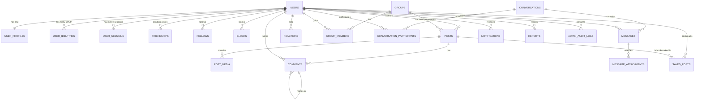
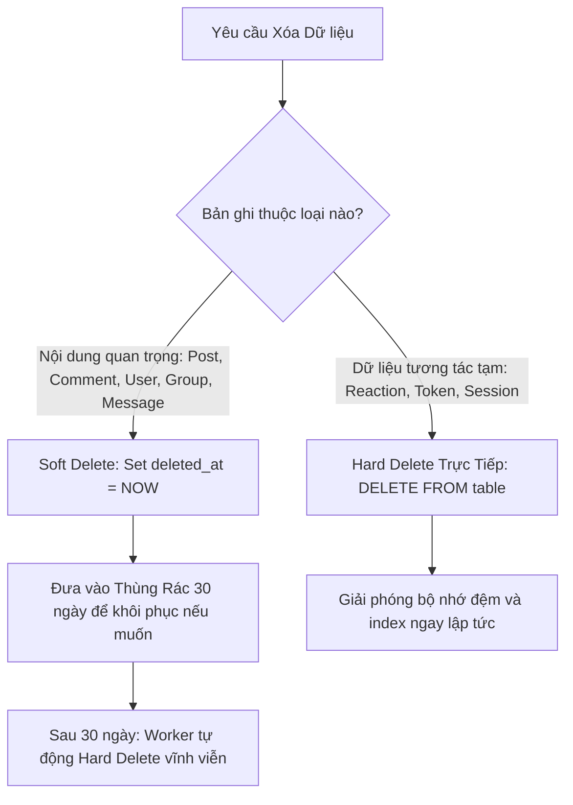

# 03. Thiết kế Cơ sở Dữ liệu & TypeORM Schema (Database Schema & ERD)

---

## 1. Sơ đồ Quan hệ Thực thể (Entity-Relationship Diagram - ERD)



---

## 2. Chi tiết Định nghĩa Thực thể TypeORM (Entity Definitions)

### 2.1. Module Người dùng & Xác thực (Users & Auth)

#### Bảng `users`
Bảng lưu trữ danh tính người dùng cốt lõi:
```typescript
@Entity('users')
export class User {
  @PrimaryGeneratedColumn('uuid')
  id: string;

  @Column({ unique: true, length: 255 })
  email: string;

  @Column({ unique: true, length: 50 })
  username: string;

  @Column({ name: 'password_hash', nullable: true })
  passwordHash?: string; // Nullable đối với tài khoản chỉ dùng Social OAuth

  @Column({ name: 'is_verified', default: false })
  isVerified: boolean;

  @Column({
    type: 'enum',
    enum: ['PENDING_VERIFICATION', 'ACTIVE', 'SUSPENDED', 'DEACTIVATED'],
    default: 'PENDING_VERIFICATION'
  })
  status: string;

  @Column({ type: 'enum', enum: ['USER', 'ADMIN'], default: 'USER' })
  role: string;

  @CreateDateColumn({ name: 'created_at' })
  createdAt: Date;

  @UpdateDateColumn({ name: 'updated_at' })
  updatedAt: Date;

  @DeleteDateColumn({ name: 'deleted_at' })
  deletedAt?: Date;

  @OneToOne(() => UserProfile, (profile) => profile.user, { cascade: true })
  profile: UserProfile;

  @OneToMany(() => UserIdentity, (identity) => identity.user)
  identities: UserIdentity[];
}
```

#### Bảng `user_profiles`
Thông tin chi tiết hồ sơ cá nhân và cài đặt riêng tư:
```typescript
@Entity('user_profiles')
export class UserProfile {
  @PrimaryGeneratedColumn('uuid')
  id: string;

  @Column({ name: 'user_id', type: 'uuid' })
  userId: string;

  @OneToOne(() => User, (user) => user.profile, { onDelete: 'CASCADE' })
  @JoinColumn({ name: 'user_id' })
  user: User;

  @Column({ name: 'full_name', length: 100 })
  fullName: string;

  @Column({ name: 'avatar_url', nullable: true, length: 500 })
  avatarUrl?: string;

  @Column({ name: 'cover_url', nullable: true, length: 500 })
  coverUrl?: string;

  @Column({ type: 'varchar', length: 255, nullable: true })
  bio?: string;

  @Column({ length: 100, nullable: true })
  location?: string;

  @Column({ name: 'website_url', length: 255, nullable: true })
  websiteUrl?: string;

  @Column({ type: 'enum', enum: ['MALE', 'FEMALE', 'OTHER', 'SECRET'], default: 'SECRET' })
  gender: string;

  @Column({ name: 'date_of_birth', type: 'date', nullable: true })
  dateOfBirth?: Date;

  @Column({ type: 'jsonb', default: () => `'{"friendList": "PUBLIC", "whoCanMessage": "EVERYONE"}'` })
  privacySettings: Record<string, any>;

  @CreateDateColumn({ name: 'created_at' })
  createdAt: Date;

  @UpdateDateColumn({ name: 'updated_at' })
  updatedAt: Date;
}
```

#### Bảng `user_identities` (OAuth Providers)
```typescript
@Entity('user_identities')
@Unique(['provider', 'providerUserId'])
export class UserIdentity {
  @PrimaryGeneratedColumn('uuid')
  id: string;

  @Column({ name: 'user_id', type: 'uuid' })
  userId: string;

  @ManyToOne(() => User, (user) => user.identities, { onDelete: 'CASCADE' })
  @JoinColumn({ name: 'user_id' })
  user: User;

  @Column({ type: 'varchar', length: 50 })
  provider: 'GOOGLE' | 'GITHUB';

  @Column({ name: 'provider_user_id', length: 255 })
  providerUserId: string;

  @CreateDateColumn({ name: 'created_at' })
  createdAt: Date;
}
```

#### Bảng `user_sessions` (Quản lý Phiên Đa Thiết bị & Thu hồi Token)
```typescript
@Entity('user_sessions')
@Index(['userId', 'isRevoked'])
@Index(['refreshTokenHash'], { unique: true })
export class UserSession {
  @PrimaryGeneratedColumn('uuid')
  id: string;

  @Column({ name: 'user_id', type: 'uuid' })
  userId: string;

  @ManyToOne(() => User, { onDelete: 'CASCADE' })
  @JoinColumn({ name: 'user_id' })
  user: User;

  @Column({ name: 'refresh_token_hash', length: 255 })
  refreshTokenHash: string; // Hash SHA-256 của refresh token

  @Column({ name: 'device_name', length: 150 }) // e.g. "Chrome 122 on macOS"
  deviceName: string;

  @Column({
    name: 'device_type',
    type: 'enum',
    enum: ['DESKTOP', 'MOBILE', 'TABLET', 'UNKNOWN'],
    default: 'UNKNOWN'
  })
  deviceType: string;

  @Column({ name: 'ip_address', length: 45 })
  ipAddress: string;

  @Column({ name: 'user_agent', type: 'text' })
  userAgent: string;

  @Column({ name: 'is_revoked', default: false })
  isRevoked: boolean;

  @Column({ name: 'expires_at' })
  expiresAt: Date;

  @Column({ name: 'last_active_at' })
  lastActiveAt: Date;

  @CreateDateColumn({ name: 'created_at' })
  createdAt: Date;
}
```

---

### 2.2. Module Quan hệ Xã hội (Relationships)

#### Bảng `friendships`
```typescript
@Entity('friendships')
@Index(['userId', 'friendId'], { unique: true })
export class Friendship {
  @PrimaryGeneratedColumn('uuid')
  id: string;

  @Column({ name: 'user_id', type: 'uuid' })
  userId: string; // Người gửi lời mời

  @Column({ name: 'friend_id', type: 'uuid' })
  friendId: string; // Người nhận lời mời

  @Column({
    type: 'enum',
    enum: ['PENDING', 'ACCEPTED', 'REJECTED'],
    default: 'PENDING'
  })
  status: string;

  @CreateDateColumn({ name: 'created_at' })
  createdAt: Date;

  @UpdateDateColumn({ name: 'updated_at' })
  updatedAt: Date;
}
```

#### Bảng `follows`
```typescript
@Entity('follows')
@Index(['followerId', 'followingId'], { unique: true })
export class Follow {
  @PrimaryGeneratedColumn('uuid')
  id: string;

  @Column({ name: 'follower_id', type: 'uuid' })
  followerId: string;

  @Column({ name: 'following_id', type: 'uuid' })
  followingId: string;

  @CreateDateColumn({ name: 'created_at' })
  createdAt: Date;
}
```

#### Bảng `blocks`
```typescript
@Entity('blocks')
@Index(['blockerId', 'blockedId'], { unique: true })
export class Block {
  @PrimaryGeneratedColumn('uuid')
  id: string;

  @Column({ name: 'blocker_id', type: 'uuid' })
  blockerId: string;

  @Column({ name: 'blocked_id', type: 'uuid' })
  blockedId: string;

  @CreateDateColumn({ name: 'created_at' })
  createdAt: Date;
}
```

---

### 2.3. Module Bài đăng & Media (Posts & PostMedia)

#### Bảng `posts`
```typescript
@Entity('posts')
@Index(['authorId', 'createdAt'])
@Index(['groupId', 'createdAt'])
export class Post {
  @PrimaryGeneratedColumn('uuid')
  id: string;

  @Column({ name: 'author_id', type: 'uuid' })
  authorId: string;

  @Column({ name: 'group_id', type: 'uuid', nullable: true })
  groupId?: string;

  @Column({ type: 'text', nullable: true })
  content?: string;

  @Column({
    type: 'enum',
    enum: ['PUBLIC', 'FRIENDS', 'PRIVATE', 'GROUP'],
    default: 'PUBLIC'
  })
  privacy: string;

  @Column({ name: 'reaction_count', default: 0 })
  reactionCount: number;

  @Column({ name: 'comment_count', default: 0 })
  commentCount: number;

  @Column({ name: 'share_count', default: 0 })
  shareCount: number;

  // Dùng khi share một bài viết khác
  @Column({ name: 'original_post_id', type: 'uuid', nullable: true })
  originalPostId?: string;

  // Tính năng Ghim bài viết (Pin Post)
  @Column({ name: 'is_pinned_in_profile', default: false })
  isPinnedInProfile: boolean;

  @Column({ name: 'is_pinned_in_group', default: false })
  isPinnedInGroup: boolean;

  @Column({ name: 'pinned_at', type: 'timestamp', nullable: true })
  pinnedAt?: Date;

  @CreateDateColumn({ name: 'created_at' })
  createdAt: Date;

  @UpdateDateColumn({ name: 'updated_at' })
  updatedAt: Date;

  @DeleteDateColumn({ name: 'deleted_at' })
  deletedAt?: Date;

  @OneToMany(() => PostMedia, (media) => media.post, { cascade: true })
  media: PostMedia[];
}
```

#### Bảng `post_media`
```typescript
@Entity('post_media')
export class PostMedia {
  @PrimaryGeneratedColumn('uuid')
  id: string;

  @Column({ name: 'post_id', type: 'uuid' })
  postId: string;

  @ManyToOne(() => Post, (post) => post.media, { onDelete: 'CASCADE' })
  @JoinColumn({ name: 'post_id' })
  post: Post;

  @Column({ name: 'media_url', length: 500 })
  mediaUrl: string;

  @Column({ type: 'enum', enum: ['IMAGE', 'VIDEO'] })
  mediaType: string;

  @Column({ name: 'thumbnail_url', length: 500, nullable: true })
  thumbnailUrl?: string;

  @Column({ name: 'order_index', default: 0 })
  orderIndex: number;

  @Column({ name: 'size_bytes', type: 'bigint', nullable: true })
  sizeBytes?: number;

  @CreateDateColumn({ name: 'created_at' })
  createdAt: Date;
}
```

#### Bảng `saved_posts` (Lưu trữ Bài viết & Bộ sưu tập)
```typescript
@Entity('saved_posts')
@Index(['userId', 'collectionName', 'createdAt'])
@Index(['userId', 'postId'], { unique: true })
export class SavedPost {
  @PrimaryGeneratedColumn('uuid')
  id: string;

  @Column({ name: 'user_id', type: 'uuid' })
  userId: string;

  @ManyToOne(() => User, { onDelete: 'CASCADE' })
  @JoinColumn({ name: 'user_id' })
  user: User;

  @Column({ name: 'post_id', type: 'uuid' })
  postId: string;

  @ManyToOne(() => Post, { onDelete: 'CASCADE' })
  @JoinColumn({ name: 'post_id' })
  post: Post;

  @Column({ name: 'collection_name', length: 100, default: 'Default' })
  collectionName: string;

  @CreateDateColumn({ name: 'created_at' })
  createdAt: Date;
}
```

---

### 2.4. Module Bình luận & Cảm xúc (Comments & Reactions)

#### Bảng `comments`
Hỗ trợ kiến trúc 2 cấp (Root comment và Replies):
```typescript
@Entity('comments')
@Index(['postId', 'createdAt'])
@Index(['rootCommentId'])
export class Comment {
  @PrimaryGeneratedColumn('uuid')
  id: string;

  @Column({ name: 'post_id', type: 'uuid' })
  postId: string;

  @Column({ name: 'author_id', type: 'uuid' })
  authorId: string;

  // Nếu là Reply, trỏ tới comment cha trực tiếp
  @Column({ name: 'parent_id', type: 'uuid', nullable: true })
  parentId?: string;

  // Cố định ID của comment gốc cấp 1 để gom nhóm truy vấn siêu nhanh
  @Column({ name: 'root_comment_id', type: 'uuid', nullable: true })
  rootCommentId?: string;

  @Column({ type: 'text' })
  content: string;

  @Column({ name: 'media_url', length: 500, nullable: true })
  mediaUrl?: string;

  @Column({ name: 'reaction_count', default: 0 })
  reactionCount: number;

  @Column({ name: 'reply_count', default: 0 })
  replyCount: number;

  @CreateDateColumn({ name: 'created_at' })
  createdAt: Date;

  @UpdateDateColumn({ name: 'updated_at' })
  updatedAt: Date;

  @DeleteDateColumn({ name: 'deleted_at' })
  deletedAt?: Date;
}
```

#### Bảng `reactions` (Post & Comment Reactions)
Sử dụng mô hình đa hình (Polymorphic Pattern) tối ưu:
```typescript
@Entity('reactions')
@Index(['targetType', 'targetId', 'userId'], { unique: true })
export class Reaction {
  @PrimaryGeneratedColumn('uuid')
  id: string;

  @Column({ name: 'user_id', type: 'uuid' })
  userId: string;

  @Column({ name: 'target_type', type: 'enum', enum: ['POST', 'COMMENT'] })
  targetType: 'POST' | 'COMMENT';

  @Column({ name: 'target_id', type: 'uuid' })
  targetId: string;

  @Column({
    type: 'enum',
    enum: ['LIKE', 'LOVE', 'CARE', 'HAHA', 'WOW', 'SAD', 'ANGRY']
  })
  reactionType: string;

  @CreateDateColumn({ name: 'created_at' })
  createdAt: Date;
}
```

---

### 2.5. Module Cộng đồng / Nhóm (Groups & Group Members)

#### Bảng `groups`
```typescript
@Entity('groups')
export class Group {
  @PrimaryGeneratedColumn('uuid')
  id: string;

  @Column({ name: 'owner_id', type: 'uuid' })
  ownerId: string;

  @Column({ length: 150 })
  name: string;

  @Column({ unique: true, length: 150 })
  slug: string;

  @Column({ type: 'text', nullable: true })
  description?: string;

  @Column({ name: 'avatar_url', length: 500, nullable: true })
  avatarUrl?: string;

  @Column({ name: 'cover_url', length: 500, nullable: true })
  coverUrl?: string;

  @Column({ type: 'enum', enum: ['PUBLIC', 'PRIVATE'], default: 'PUBLIC' })
  privacy: string;

  @Column({ name: 'is_post_approval_required', default: false })
  isPostApprovalRequired: boolean;

  @Column({ name: 'member_count', default: 1 })
  memberCount: number;

  @CreateDateColumn({ name: 'created_at' })
  createdAt: Date;

  @UpdateDateColumn({ name: 'updated_at' })
  updatedAt: Date;

  @DeleteDateColumn({ name: 'deleted_at' })
  deletedAt?: Date;
}
```

#### Bảng `group_members`
```typescript
@Entity('group_members')
@Index(['groupId', 'userId'], { unique: true })
export class GroupMember {
  @PrimaryGeneratedColumn('uuid')
  id: string;

  @Column({ name: 'group_id', type: 'uuid' })
  groupId: string;

  @Column({ name: 'user_id', type: 'uuid' })
  userId: string;

  @Column({ type: 'enum', enum: ['ADMIN', 'MODERATOR', 'MEMBER'], default: 'MEMBER' })
  role: string;

  @Column({ type: 'enum', enum: ['PENDING', 'ACTIVE', 'BANNED'], default: 'ACTIVE' })
  status: string;

  @CreateDateColumn({ name: 'joined_at' })
  joinedAt: Date;
}
```

---

### 2.6. Module Trò chuyện Thời gian thực (Chat & Messages)

#### Bảng `conversations`
```typescript
@Entity('conversations')
export class Conversation {
  @PrimaryGeneratedColumn('uuid')
  id: string;

  @Column({ type: 'enum', enum: ['DIRECT', 'GROUP'], default: 'DIRECT' })
  type: string;

  @Column({ length: 150, nullable: true })
  name?: string; // Dùng cho group chat

  @Column({ name: 'avatar_url', length: 500, nullable: true })
  avatarUrl?: string;

  @Column({ name: 'last_message_id', type: 'uuid', nullable: true })
  lastMessageId?: string;

  @CreateDateColumn({ name: 'created_at' })
  createdAt: Date;

  @UpdateDateColumn({ name: 'updated_at' })
  updatedAt: Date;
}
```

#### Bảng `conversation_participants`
```typescript
@Entity('conversation_participants')
@Index(['conversationId', 'userId'], { unique: true })
export class ConversationParticipant {
  @PrimaryGeneratedColumn('uuid')
  id: string;

  @Column({ name: 'conversation_id', type: 'uuid' })
  conversationId: string;

  @Column({ name: 'user_id', type: 'uuid' })
  userId: string;

  @Column({ length: 100, nullable: true })
  nickname?: string;

  @Column({ name: 'is_admin', default: false })
  isAdmin: boolean;

  @Column({ name: 'last_read_message_id', type: 'uuid', nullable: true })
  lastReadMessageId?: string;

  @CreateDateColumn({ name: 'joined_at' })
  joinedAt: Date;
}
```

#### Bảng `messages` & `message_attachments`
```typescript
@Entity('messages')
@Index(['conversationId', 'createdAt'])
export class Message {
  @PrimaryGeneratedColumn('uuid')
  id: string;

  @Column({ name: 'conversation_id', type: 'uuid' })
  conversationId: string;

  @Column({ name: 'sender_id', type: 'uuid' })
  senderId: string;

  @Column({ type: 'enum', enum: ['TEXT', 'MEDIA', 'SYSTEM'], default: 'TEXT' })
  type: string;

  @Column({ type: 'text', nullable: true })
  content?: string;

  @Column({ name: 'reply_to_message_id', type: 'uuid', nullable: true })
  replyToMessageId?: string;

  @Column({ name: 'is_deleted', default: false })
  isDeleted: boolean;

  @CreateDateColumn({ name: 'created_at' })
  createdAt: Date;

  @OneToMany(() => MessageAttachment, (att) => att.message, { cascade: true })
  attachments: MessageAttachment[];
}

@Entity('message_attachments')
export class MessageAttachment {
  @PrimaryGeneratedColumn('uuid')
  id: string;

  @Column({ name: 'message_id', type: 'uuid' })
  messageId: string;

  @ManyToOne(() => Message, (msg) => msg.attachments, { onDelete: 'CASCADE' })
  @JoinColumn({ name: 'message_id' })
  message: Message;

  @Column({ name: 'file_url', length: 500 })
  fileUrl: string;

  @Column({ name: 'file_type', length: 50 })
  fileType: string;

  @Column({ name: 'file_size', type: 'bigint', nullable: true })
  fileSize?: number;

  @CreateDateColumn({ name: 'created_at' })
  createdAt: Date;
}
```

---

### 2.7. Module Thông báo (Notifications)

#### Bảng `notifications`
```typescript
@Entity('notifications')
@Index(['recipientId', 'createdAt'])
@Index(['recipientId', 'isRead'])
export class Notification {
  @PrimaryGeneratedColumn('uuid')
  id: string;

  @Column({ name: 'recipient_id', type: 'uuid' })
  recipientId: string;

  @Column({ name: 'actor_id', type: 'uuid', nullable: true })
  actorId?: string; // Người tạo ra hành động

  @Column({
    type: 'enum',
    enum: [
      'FRIEND_REQUEST_RECEIVED',
      'FRIEND_REQUEST_ACCEPTED',
      'POST_REACTION',
      'POST_COMMENT',
      'COMMENT_REPLY',
      'USER_MENTIONED',
      'GROUP_INVITATION',
      'GROUP_POST_APPROVED'
    ]
  })
  type: string;

  @Column({ name: 'entity_type', length: 50 }) // 'POST', 'COMMENT', 'GROUP', 'USER'
  entityType: string;

  @Column({ name: 'entity_id', type: 'uuid' })
  entityId: string;

  @Column({ type: 'text' })
  content: string;

  @Column({ name: 'is_read', default: false })
  isRead: boolean;

  @Column({ type: 'jsonb', nullable: true })
  metadata?: Record<string, any>; // Lưu thông tin phụ hoặc nhóm người tương tác

  @CreateDateColumn({ name: 'created_at' })
  createdAt: Date;
}
```

---

### 2.8. Module Quản trị Nền tảng & Kiểm duyệt (Admin & Moderation)

#### Bảng `reports` (Báo cáo vi phạm từ người dùng)
```typescript
@Entity('reports')
@Index(['targetType', 'targetId'])
@Index(['status', 'createdAt'])
export class Report {
  @PrimaryGeneratedColumn('uuid')
  id: string;

  @Column({ name: 'reporter_id', type: 'uuid' })
  reporterId: string;

  @Column({ name: 'target_type', type: 'enum', enum: ['POST', 'COMMENT', 'GROUP', 'USER'] })
  targetType: 'POST' | 'COMMENT' | 'GROUP' | 'USER';

  @Column({ name: 'target_id', type: 'uuid' })
  targetId: string;

  @Column({
    type: 'enum',
    enum: [
      'SPAM',
      'HATE_SPEECH',
      'HARASSMENT',
      'NUDITY_PORN',
      'VIOLENCE',
      'COPYRIGHT',
      'OTHER'
    ]
  })
  reason: string;

  @Column({ type: 'text', nullable: true })
  details?: string;

  @Column({
    type: 'enum',
    enum: ['PENDING', 'RESOLVED', 'DISMISSED'],
    default: 'PENDING'
  })
  status: string;

  @Column({ name: 'resolved_by_id', type: 'uuid', nullable: true })
  resolvedById?: string;

  @Column({ name: 'resolution_notes', type: 'text', nullable: true })
  resolutionNotes?: string;

  @CreateDateColumn({ name: 'created_at' })
  createdAt: Date;

  @UpdateDateColumn({ name: 'updated_at' })
  updatedAt: Date;
}
```

#### Bảng `admin_audit_logs` (Nhật ký hành động của Admin)
```typescript
@Entity('admin_audit_logs')
@Index(['adminId', 'createdAt'])
@Index(['targetType', 'targetId'])
export class AdminAuditLog {
  @PrimaryGeneratedColumn('uuid')
  id: string;

  @Column({ name: 'admin_id', type: 'uuid' })
  adminId: string;

  @Column({
    type: 'enum',
    enum: [
      'BAN_USER',
      'SUSPEND_USER',
      'UNBAN_USER',
      'DELETE_POST',
      'DELETE_COMMENT',
      'DELETE_GROUP',
      'RESOLVE_REPORT',
      'UPDATE_ROLE',
      'SYSTEM_BROADCAST'
    ]
  })
  action: string;

  @Column({ name: 'target_type', length: 50 })
  targetType: string;

  @Column({ name: 'target_id', length: 100 })
  targetId: string;

  @Column({ type: 'text', nullable: true })
  reason?: string;

  @Column({ type: 'jsonb', nullable: true })
  metadata?: Record<string, any>; // Lưu dữ liệu trước/sau khi thay đổi

  @Column({ name: 'ip_address', length: 45, nullable: true })
  ipAddress?: string;

  @CreateDateColumn({ name: 'created_at' })
  createdAt: Date;
}
```

---

## 3. Chiến lược Đánh Index Toàn diện (Strategic Indexing)

Việc đánh index chuẩn xác kết hợp với **Partial Index** giúp WeShare duy trì tốc độ phản hồi $\le 100\text{ms}$ ngay cả khi cơ sở dữ liệu đạt hàng chục triệu bản ghi.

### 3.1. Ma trận Index Cốt lõi (Index Matrix)

| Bảng | Tên Index | Các Cột Index | Loại Index | Điều kiện Partial Index (`WHERE`) | Mục đích & Query Tối ưu |
|---|---|---|:---:|---|---|
| `users` | `idx_users_email` | `email` | B-Tree Unique | `deleted_at IS NULL` | Đăng nhập bằng email, kiểm tra trùng lặp nhanh |
| `users` | `idx_users_username` | `username` | B-Tree Unique | `deleted_at IS NULL` | Tìm kiếm profile theo handle `@username` |
| `users` | `idx_users_fts` | `full_name`, `username` | GIN | `deleted_at IS NULL` | Tìm kiếm full-text search người dùng theo tên |
| `posts` | `idx_posts_author_feed` | `(author_id, created_at DESC)` | B-Tree Composite | `deleted_at IS NULL` | Lấy danh sách bài viết trên trang Profile người dùng |
| `posts` | `idx_posts_group_feed` | `(group_id, created_at DESC)` | B-Tree Composite | `deleted_at IS NULL AND group_id IS NOT NULL` | Lấy bài viết trong nhóm theo thứ tự thời gian mới nhất |
| `posts` | `idx_posts_privacy_feed`| `(privacy, created_at DESC)` | B-Tree Composite | `deleted_at IS NULL` | Query Feed bài viết công khai (Public Timeline) |
| `comments`| `idx_comments_post_tree`| `(post_id, root_comment_id, created_at ASC)` | B-Tree Composite | `deleted_at IS NULL` | Lấy toàn bộ cây bình luận 2 cấp của 1 bài viết trong 1 query |
| `reactions`| `idx_reactions_target_unique`| `(target_type, target_id, user_id)` | B-Tree Unique | Không có (Bảng không soft delete) | Đảm bảo 1 user chỉ thả 1 cảm xúc, check trạng thái đã react |
| `reactions`| `idx_reactions_target_type`| `(target_type, target_id, reaction_type)` | B-Tree Composite | Không có | Đếm số lượng theo từng loại cảm xúc (`LIKE`, `LOVE`...) |
| `friendships`| `idx_friendships_lookup`| `(user_id, friend_id, status)` | B-Tree Composite | Không có | Kiểm tra quan hệ bạn bè 2 chiều siêu nhanh |
| `follows` | `idx_follows_follower` | `(follower_id, following_id)` | B-Tree Composite | Không có | Lấy danh sách người user đang theo dõi |
| `conversations`| `idx_conv_participants` | `(user_id, conversation_id)` | B-Tree Composite | Không có | Lấy danh sách các hộp chat của user |
| `messages` | `idx_messages_conv_cursor` | `(conversation_id, created_at DESC)` | B-Tree Composite | `is_deleted = false` | Load lịch sử tin nhắn phân trang ngược theo con trỏ |
| `notifications`| `idx_notif_user_unread` | `(recipient_id, created_at DESC)` | B-Tree Partial | `is_read = false` | Hiển thị badge chuông thông báo chưa đọc tức thì |
| `reports` | `idx_reports_queue` | `(status, created_at ASC)` | B-Tree Composite | `status = 'PENDING'` | Hàng đợi kiểm duyệt ưu tiên cho Admin |
| `posts` | `idx_posts_pinned_profile` | `(author_id, is_pinned_in_profile, created_at DESC)` | B-Tree Composite | `deleted_at IS NULL` | Ưu tiên load bài viết ghim trên trang cá nhân |
| `posts` | `idx_posts_pinned_group` | `(group_id, is_pinned_in_group, created_at DESC)` | B-Tree Composite | `deleted_at IS NULL AND group_id IS NOT NULL` | Ưu tiên load bài viết ghim trong nhóm |
| `saved_posts` | `idx_saved_posts_coll` | `(user_id, collection_name, created_at DESC)` | B-Tree Composite | Không có | Lấy danh sách bài viết đã lưu theo bộ sưu tập |
| `saved_posts` | `idx_saved_posts_unique` | `(user_id, post_id)` | B-Tree Unique | Không có | Chống trùng lặp bookmark bài viết |

### 3.2. Lợi ích Tối thượng của Partial Index với Soft Delete
- Khi sử dụng Soft Delete, cột `deleted_at` thường xuyên chứa giá trị `NULL` cho các bản ghi còn hoạt động.
- Index thông thường sẽ phải đánh chỉ mục cho cả hàng triệu bản ghi đã bị xóa, gây lãng phí bộ nhớ RAM đệm (Buffer Pool) của PostgreSQL.
- **Partial Index với `WHERE deleted_at IS NULL`** giúp giảm dung lượng index từ **30% - 60%**, và mọi câu truy vấn bình thường của người dùng đều rơi trúng index này với hiệu năng tối đa.

---

## 4. Chiến lược Soft Delete & Ma trận Áp dụng

Không phải bảng nào trong mạng xã hội cũng nên Soft Delete. Nếu lạm dụng, database sẽ bị phình rác không kiểm soát.



### 4.1. Ma trận Soft Delete vs Hard Delete

| Bảng | Cơ chế Xóa | Lý do Thiết kế |
|---|:---:|---|
| `users` | **Soft Delete** | Người dùng có 30 ngày ân hạn để hủy xóa tài khoản. Giữ dữ liệu để giải quyết khiếu nại bản quyền/pháp lý. |
| `posts` | **Soft Delete** | Cho phép người dùng chuyển bài viết vào "Thùng rác (Trash)" và khôi phục trong 30 ngày. |
| `comments` | **Soft Delete** | Khi xóa bình luận cha, bình luận con vẫn hiển thị dạng *"Bình luận này đã bị xóa"* để không làm gãy ngữ cảnh của luồng thảo luận. |
| `groups` | **Soft Delete** | Nhóm bị giải tán có thể cần khiếu nại hoặc kiểm toán từ Admin toàn sàn. |
| `messages` | **Soft Delete** (`is_deleted`) | Thu hồi tin nhắn chat (hiển thị *"Tin nhắn đã được thu hồi"* ở cả 2 phía). |
| `reactions` | **Hard Delete** | Khi user bỏ thả tim/like, bản ghi phải bị xóa ngay lập tức để tiết kiệm hàng chục triệu row và giảm tải index. |
| `friendships` | **Hard Delete / Status update** | Hủy kết bạn có thể xóa row hoặc đổi status để không tốn dung lượng vô ích. |
| `user_identities` | **Hard Delete** | Khi user hủy liên kết tài khoản Google/GitHub. |

---

## 5. Chính sách Định kỳ Xóa Dữ liệu Rác (Data Retention & Periodic Purge Policy)

Nếu chỉ Soft Delete mà không có chính sách **Dọn dẹp Định kỳ (Periodic Purging)**, database sẽ phình to không giới hạn, làm chậm backup, và tốn kém chi phí đĩa cứng.

### 5.1. Bảng Chính sách Lưu trữ & Dọn dẹp (Retention Rules)

| Loại Dữ liệu | Thời gian Lưu trữ (TTL) | Cơ chế Xóa / Dọn dẹp | Tần suất Chạy Job | Tác vụ Kèm theo |
|---|:---:|---|:---:|---|
| **Posts & Comments trong Thùng rác** | **30 ngày** kể từ khi `deleted_at` | Hard Delete khỏi PostgreSQL | Hàng ngày (02:00 AM) | Đẩy task vào RabbitMQ để xóa toàn bộ file ảnh/video liên quan trên Supabase Storage |
| **Tài khoản User đã yêu cầu xóa** | **30 ngày** ân hạn | Hard Delete hoặc Vô danh hóa (Anonymize) | Hàng ngày (02:30 AM) | Xóa profile, unfriend toàn bộ, xóa avatar/cover trên Supabase |
| **Notifications đã đọc** | **60 ngày** | Hard Delete khỏi bảng `notifications` | Hàng tuần (Chủ nhật 03:00 AM) | Giảm dung lượng bảng thông báo vốn phình rất nhanh |
| **Notifications chưa đọc** | **180 ngày** (6 tháng) | Hard Delete khỏi bảng `notifications` | Hàng tháng | Dọn các thông báo cũ không còn giá trị |
| **Tệp Upload Mồ côi (Orphaned Media)** | **24 giờ** không được gán vào Post/Profile | Xóa tệp rác trên Supabase Storage | Hàng ngày (04:00 AM) | Quét các tệp được cấp presigned URL nhưng client không hoàn tất đăng bài |
| **Admin Audit Logs** | **365 ngày** (1 năm) | Archive ra Cold Storage (S3) rồi Purge DB | Hàng quý | Đảm bảo tuân thủ pháp lý mà không làm nặng PostgreSQL |

### 5.2. Kỹ thuật Xóa An toàn: Chunked Deletion (Tránh Khóa Bảng)

Khi xóa hàng chục nghìn bản ghi cùng lúc bằng lệnh `DELETE FROM posts WHERE ...`, PostgreSQL sẽ bị **Lock Table** và sinh ra lượng WAL Logs khổng lồ làm treo hệ thống.

**Giải pháp Chuẩn Senior**: Xóa theo từng mẻ nhỏ (Chunks of 500 - 1.000 rows) kết hợp sleep ngắn giữa các batch:

```sql
-- Ví dụ: Xóa theo mẻ 1.000 dòng để không bao giờ làm nghẽn DB
DO $$
DECLARE
    deleted_count INT;
BEGIN
    LOOP
        WITH to_delete AS (
            SELECT id FROM posts
            WHERE deleted_at < NOW() - INTERVAL '30 days'
            LIMIT 1000
        )
        DELETE FROM posts
        WHERE id IN (SELECT id FROM to_delete);
        
        GET DIAGNOSTICS deleted_count = ROW_COUNT;
        EXIT WHEN deleted_count = 0;
        
        -- Nghỉ 100ms giữa các mẻ để nhường I/O cho người dùng khác
        PERFORM pg_sleep(0.1);
    END LOOP;
END $$;
```

---

## 6. Kiến trúc Triển khai Cron Job Dọn dẹp trong NestJS: Đánh giá & Lựa chọn Tối ưu

Khi triển khai hệ thống có tải cao với nhiều container NestJS (API instances) chạy đồng thời sau Nginx Load Balancer, nếu không thiết kế cẩn thận, lúc 02:00 AM **tất cả các container sẽ cùng chạy một cron job** $\rightarrow$ gây ra tình trạng tranh chấp dữ liệu (Race condition), nghẽn mạng và lãng phí CPU.

### 6.1. Bảng So sánh Chuyên sâu: Cách 1 vs. Cách 2

| Tiêu chí So sánh | Cách 1: Redis Distributed Lock (Redlock) trong API Container | Cách 2: Tách Container Chuyên biệt `weshare-worker` (ĐƯỢC CHỌN) |
|---|---|---|
| **Ảnh hưởng Người dùng (User Latency)** | 🔴 **Kém**: Khi Cron job chạy ngầm (xóa hàng vạn post, xóa ảnh S3), process Node.js bị chiếm dụng Event Loop & RAM, khiến các HTTP requests và tin nhắn Socket của người dùng kết nối tới container đó bị **giật/lag/timeout**. | 🟢 **Xuất sắc**: Hoàn toàn cô lập (Process Isolation). API container chỉ tập trung phục vụ người dùng siêu nhanh. Mọi tác vụ nặng chạy ở Worker container riêng. |
| **Độ ổn định khi Auto-scaling** | 🟡 **Trung bình**: Nếu container đang giữ Redis Lock bị hệ thống Auto-scaler hoặc Kubernetes restart/kill giữa chừng, lock có thể bị treo đến khi hết TTL hoặc job bị bỏ dở. | 🟢 **Rất cao**: Worker container chạy độc lập (Singleton Replica = 1), không bị ảnh hưởng bởi việc API scale-out theo lượng truy cập. |
| **Giới hạn Tài nguyên (Resource Allocation)** | 🔴 **Khó cân chỉnh**: Phải cấp dung lượng RAM/CPU dư thừa cho tất cả các API containers chỉ để phòng hờ lúc Cron chạy. | 🟢 **Tối ưu chi phí**: Cấp RAM/CPU riêng cho Worker trong Docker/Kubernetes (`resources.limits`), không lãng phí tài nguyên server. |
| **Tận dụng kiến trúc (Architectural Fit)** | 🟡 **Rời rạc**: API vừa gánh HTTP, vừa gánh Socket, vừa gánh RabbitMQ Consumer, vừa gánh Cron job. | 🟢 **Chuẩn Clean Architecture**: `weshare-api` chỉ lo Client (HTTP + WSS). `weshare-worker` gom chung toàn bộ RabbitMQ Consumers + Scheduled Cron Jobs. |
| **Độ phức tạp Codebase** | Cần cài thêm thư viện Redlock, quản lý TTL và release lock thủ công. | **Chung 1 codebase 100%**, chung TypeORM entities, chung Dockerfile, chỉ khác 1 biến môi trường `APP_TYPE=worker`. |

---

### 6.2. Quyết định Kiến trúc: Chọn CÁCH 2 (Tách Container `weshare-worker`)

**Kết luận**: **Cách 2 vượt trội hơn hẳn** và là chuẩn mực thực tế của các hệ thống Production lớn.

#### Thiết lập Thực tế trên Docker Compose:
Cả 2 container đều build từ **cùng 1 Dockerfile duy nhất của backend**, chỉ khác lệnh khởi chạy:

```yaml
services:
  # 1. Container chuyên phục vụ Người dùng (Scale 2-5 instances tuỳ tải)
  weshare-api:
    build:
      context: ./backend
      dockerfile: Dockerfile
    command: node dist/main.js
    environment:
      - APP_TYPE=api
    ports:
      - "3000:3000"
    depends_on:
      - postgres
      - redis
      - rabbitmq

  # 2. Container chuyên xử lý ngầm (Chỉ cần 1 instance duy nhất)
  weshare-worker:
    build:
      context: ./backend
      dockerfile: Dockerfile
    command: node dist/worker.js
    environment:
      - APP_TYPE=worker
    depends_on:
      - postgres
      - redis
      - rabbitmq
```

#### Cấu trúc Mã nguồn trong NestJS:
- `src/main.ts`: Khởi chạy HTTP Server, Swagger, Socket.io Gateway.
- `src/worker.ts`: Khởi chạy NestJS Application Context (không mở HTTP port), chỉ lắng nghe **RabbitMQ Queues** và kích hoạt các **Cron Jobs (`@nestjs/schedule`)**.
- Nhờ đó, người dùng lướt WeShare luôn có độ trễ mượt mà nhất mà không bao giờ bị nghẽn bởi các tiến trình dọn dẹp lúc nửa đêm!


