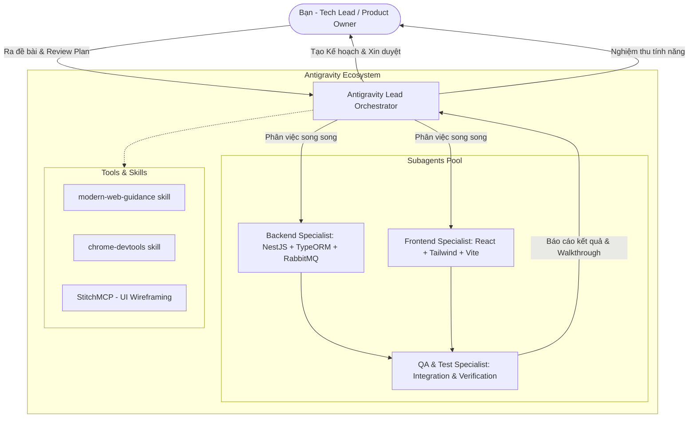
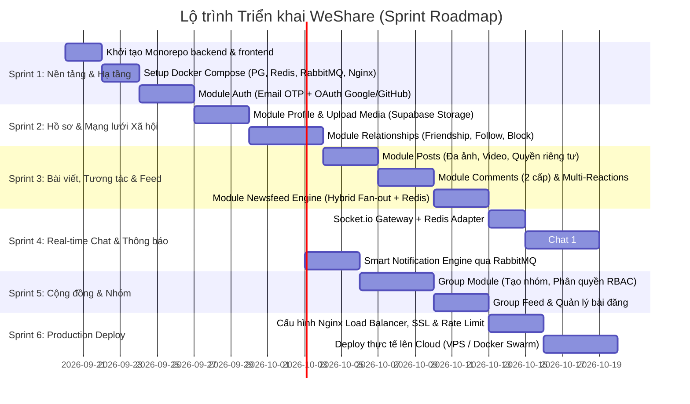

# 05. Cẩm nang Phát triển cùng AI Agent trên Antigravity (Dev Playbook)

---

## 1. Triết lý làm việc cùng AI Agent như một Senior Tech Lead

Một kỹ sư Senior/Lead không sử dụng AI như một công cụ "hỏi đáp code vụn vặt" (code snippets), mà quản lý AI như một **Đội ngũ Kỹ sư Chuyên trách (Multi-Agent Engineering Team)**.

Trong Antigravity, bạn nắm quyền chỉ huy (Architect / Tech Lead), và Antigravity đóng vai trò:
1. **Lead Orchestrator**: Phân rã bài toán, lập kế hoạch chi tiết (`implementation_plan.md`), kiểm duyệt các quyết định kiến trúc.
2. **Specialized Subagents**: Các kỹ sư chuyên biệt thực thi song song (Backend Engineer, Frontend Engineer, QA Tester).
3. **Skills & MCP Tools**: Vũ khí hỗ trợ kỹ thuật chuyên sâu (tra cứu chuẩn web hiện đại, đo lường performance, render wireframe UI).

---

## 2. Các Công cụ & Kỹ thuật Cốt lõi trên Antigravity

### 2.1. Quy trình Planning Mode & Artifacts
Mỗi khi bắt đầu một tính năng mới hoặc thay đổi kiến trúc lớn:
1. **Research & Draft Plan**: Agent sẽ không tự ý sửa code bừa bãi mà sẽ nghiên cứu codebase và tạo tệp `implementation_plan.md` trong thư mục artifact.
2. **Review & Proceed**: Bạn duyệt kế hoạch, xem xét các câu hỏi mở (Open Questions) và nhấn nút **Proceed** để bắt đầu thi công.
3. **Verify & Walkthrough**: Sau khi hoàn thành, Agent tạo tệp `walkthrough.md` tổng kết các thay đổi, kết quả test và hướng dẫn kiểm thử thực tế.

### 2.2. Vận hành Subagents Chuyên biệt (Parallel Subagents)
Bạn có thể yêu cầu Agent kích hoạt các subagent bằng `define_subagent` và `invoke_subagent`:

1. **`be-specialist` (Kỹ sư Backend)**:
   - *Trách nhiệm*: Tạo NestJS module, TypeORM entities, migrations, RabbitMQ consumers, Redis cache logic, unit test.
2. **`fe-specialist` (Kỹ sư Frontend)**:
   - *Trách nhiệm*: Tạo React components, Tailwind styling, Zustand stores, Socket.io listeners, TanStack Query hooks.
3. **`qa-verifier` (Kỹ sư Kiểm thử)**:
   - *Trách nhiệm*: Chạy E2E tests, kiểm thử các trường hợp biên (nhập sai mật khẩu 5 lần, mất kết nối mạng, tải file quá dung lượng cho phép).

### 2.3. Sử dụng Skills & MCP Tools Phù hợp
- **`modern-web-guidance`**: Luôn được kích hoạt trước khi viết giao diện frontend để đảm bảo sử dụng chuẩn web mới nhất (Container Queries, View Transitions, tối ưu hình ảnh, semantic HTML).
- **`StitchMCP`**: Dùng để phác thảo các màn hình UI (Feed card, Chat window, Profile header) thành wireframe hoặc trích xuất Design Tokens (bảng màu, spacing, typography) trước khi code giao diện React.
- **`chrome-devtools` & `a11y-debugging`**: Dùng để kiểm tra hiệu năng (LCP, CLS, INP), rò rỉ bộ nhớ (Memory Leaks khi giữ kết nối WebSocket lâu) và chuẩn trợ năng WCAG.

### 2.4. Các Slash Commands Khuyên dùng
- `/grill-me`: Sử dụng lệnh này khi bạn muốn AI phỏng vấn sâu bạn để làm rõ các quyết định thiết kế (ví dụ: trade-off giữa Cursor-based vs Offset pagination, chọn storage bucket public hay private).
- `/goal`: Sử dụng khi bạn muốn Agent thực hiện một nhiệm vụ dài hơi (ví dụ: "Setup toàn bộ docker-compose và chạy thử nghiệm migrate database thành công rồi mới dừng lại").
- `/boost`: Dùng khi gặp bài toán thuật toán phức tạp (ví dụ: tối ưu thuật toán gợi ý bạn bè hoặc tối ưu hoá RabbitMQ DLX retry).

---

## 3. Lộ trình Triển khai Dự án (Sprint Roadmap)

---

## 4. Bắt đầu Sprint 1: Các bước thực hiện kế tiếp

Để bắt đầu Sprint 1 ngay bây giờ:
1. **Khởi tạo thư mục `backend/`** bằng NestJS CLI, cài đặt TypeORM, `@nestjs/typeorm`, `pg`, `redis`, `amqplib`, `@nestjs/jwt`, `passport`.
2. **Khởi tạo thư mục `frontend/`** bằng Vite (`react-ts`), cài đặt Tailwind CSS, `lucide-react`, `@tanstack/react-query`, `zustand`, `axios`, `socket.io-client`.
3. **Viết tệp `docker-compose.yml`** để khởi chạy local: PostgreSQL (port 5432), Redis (port 6379), RabbitMQ (port 5672 và Management UI 15672).
